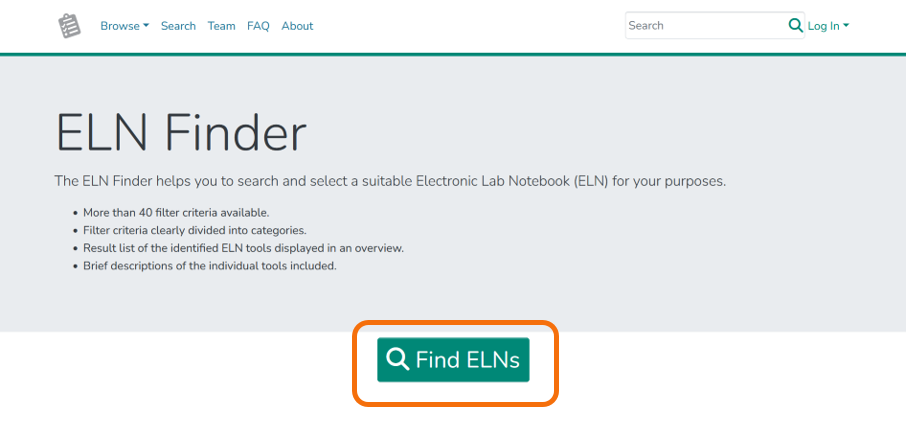
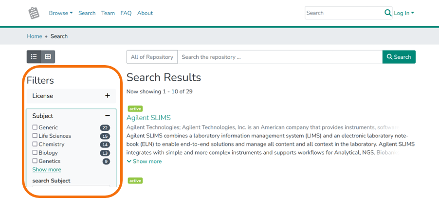

# 1.1 Introduction to Electronic Lab Notebooks

>The content in this section is adapted from [service team RDM@KIT](https://www.rdm.kit.edu/english/researchdata_rdm_eln.php).

**For planning, conducting and analyzing research experiments, electronic laboratory notebooks are becoming more and more common, thus contributing to the digitization of research.**

Laboratory notebooks play an important role in the **planning, conducting and analysis of (natural) scientific experiments**. Lab books are traditionally analogue and paper-based, an approach that is no longer up-to-date, as research data is primarily available in digital form. The solution are **electronic laboratory notebooks (ELNs)**. These offer significant [advantages](https://www.publisso.de/en/research-data-management/rd-documenting/benefits-of-an-eln). They can be linked directly to laboratory devices, analysis software or storage systems, making results more reproducible and research more efficient.

There is now a whole range of ELNs adapted to the **various needs of different scientific disciplines**. Two of them are [Chemotion ELN](https://chemotion.net/) and [Kadi4Mat](https://kadi.iam.kit.edu/), both developed at KIT. More information on these two ELNs can be found at the section "[Services & Tools](https://www.rdm.kit.edu/english/servicestools.php)".

For assistance on selcting and implementing an ELN, please refer to the [ELN Guide](https://doi.org/10.4126/FRL01-006425772) and the [ELN Finder](https://eln-finder.ulb.tu-darmstadt.de/home). Further information can be found at [forschungsdaten.org](https://www.forschungsdaten.org/index.php/Elektronische_Laborb%C3%BCcher).

## Syllabus Elements

### Learning Objectives
- min one learning objective using the verbs from the Blooms taxonomy

### Target Audience
- Students
- PhD Students

### Duration
- 1.5 hours

### Prerequisites
- FAIR
- Good research practise

### Learning Tools

- list any tools that are necessary to be used to complete the learning unit
- examples include required software, access to resources, etc.

## Learning Content Topic

### What is a laboratory notebook?

#### Advantages and disadvantages of lab notebooks

### The solution: Electronic Laboratory Notebooks (ELNs)

>The content in this section is adapted from [ELN Finder](https://eln-finder.ulb.tu-darmstadt.de/info/page/faq)

An electronic lab notebook (ELN) is a specialized software for:

- the structured description of an experiment, i.e. keeping records of
    - the procedure
    - the used materials and instruments
    - the observations made during the experiment (incl. photos)
    - the metadata/description of the data generated in the experiment and, if applicable, the files (or links to them) and inferences related to it
- the long term preservation and access of all this information in compliance with long-term archival criteria

#### Advantages of ELNs

>The content in this section is adapted from [ZB MED](https://www.publisso.de/en/research-data-management/rd-documenting/benefits-of-an-eln).

**Boost efficiency of everyday tasks:**

- Create, reuse and share templates for logs, processes and workflows
- Save time by taking advantage of standardisation
- Use search features and filters
- Log measurement results automatically
- Lab notebooks can be accessed from anywhere and at any time

**Make research findings traceable and verifiable:**

- Avoid switching between multiple media (e.g. between handwritten and digital entries)
- Avoid the loss of information caused by illegible entries
- Structure and visualise processes and workflows
- Use search and filter functions
- Easily create backups
- Version control and authenticating evidence
- Boost quality of data through improved consistency and standardisation of entries

**Provide a means of preparing research data for publication and digital preservation**

- Support in creating metadata
- Direct links to research data repositories, data services and publishing platforms

**Connected digital research environment:**

- Import and export functions
- Seamless interfaces to other programs
- API for integration into existing software environment
- Measuring instruments can deliver their data directly to the electronic lab notebook
- Collaboration through sharing research data, process logs, workflows
- Enables researchers to take their research work with them if they move to a different institute

#### Examples of ELNs

- [Chemotion/LabIMotion](https://chemotion.net) (Open Source)
- [Kadi4Mat](https://kadi.iam.kit.edu/) (Open Source)
- [eLabFTW](https://www.elabftw.net/) (Open Source)
- [Labfolder](https://www.labfolder.com) (commercial)
- [openBIS](https://openbis.ch) (Open Source)
- [Rspace ELN](https://www.researchspace.com/) (commercial)
- [SciNote](https://www.scinote.net/) (Open Source)
- [Labcollector](https://labcollector.com/) (commercial)
- ...

#### How do I decide which ELN fits me?

#### ELN Finder

>The content in this section is adapted from [ELN Finder](https://eln-finder.ulb.tu-darmstadt.de/home).

The [ELN Finder](https://eln-finder.ulb.tu-darmstadt.de/home) helps you to search and select a suitable Electronic Lab Notebook (ELN) for your purposes.

The ELN Finder uses the [following metadata schema](https://doi.org/10.4126/FRL01-006452815).

##### Hands on: ELN Finder

1. Go to the website: [https://eln-finder.ulb.tu-darmstadt.de/home](https://eln-finder.ulb.tu-darmstadt.de/home)
2. Click on „`Find ELNs`“
3. Search for an ELN that fits your needs using the filter criteria, e.g. `License` or `Subject` .

## Summary

At the end provide a short summary of the main points of the learning unit (these are the key takeaways that help reflect on the learning outcomes).

## Suggested Reading
- provide a list of references for further reading that should help clarify the content of the learning unit and elevate the knowledge level
- [Markdown guide](https://www.markdownguide.org/), free and open-source reference guide that explains how to use Markdown.

# References

