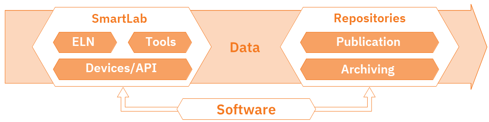

# 2.1 Introduction to Electronic Lab Notebooks

>The content in this section is adapted from [RDM@KIT](https://www.rdm.kit.edu/english/researchdata_rdm_eln.php).

**For planning, conducting and analyzing research experiments, electronic laboratory notebooks are becoming more and more common, thus contributing to the digitization of research.**

Laboratory notebooks play an important role in the **planning, conducting and analysis of (natural) scientific experiments**. Lab books are traditionally analogue and paper-based, an approach that is no longer up-to-date, as research data is primarily available in digital form. The solution are **electronic laboratory notebooks (ELNs)**. These offer significant [advantages](https://www.publisso.de/en/research-data-management/rd-documenting/benefits-of-an-eln). They can be linked directly to laboratory devices, analysis software or storage systems, making results more reproducible and research more efficient.

There is now a whole range of ELNs adapted to the **various needs of different scientific disciplines**. Two of them are [Chemotion ELN](https://chemotion.net/) and [Kadi4Mat](https://kadi.iam.kit.edu/), both are developed at KIT. More information on these two ELNs can be found at the section "[Services & Tools](https://www.rdm.kit.edu/english/servicestools.php)".

For assistance on selecting and implementing an ELN, please refer to the [ELN Guide](https://doi.org/10.4126/FRL01-006425772) and the [ELN Finder](https://eln-finder.ulb.tu-darmstadt.de/home).

---

## Syllabus Elements

### Learning Objectives

At the end of the section the learners can ...

- **Describe** what an electronic lab notebook is
- **Give examples** of electronic lab notebooks
- **Explain** advantages of an electronic lab notebook compared to a paper-based lab notebook

### Target Audience
- attendees of this course

### Duration
- 15 minutes

### Prerequisites
- Complete [01 Introduction to Research Data Management](../01%20Introduction%20to%20Research%20Data%20Management/1_RDM.md)

### Learning Tools

- none

---

## Introduction to Electronic Lab Notebooks

### What is a laboratory notebook?

- Laboratory notebooks are used to document, conduct and analyze scientific experiments and research data generated during the process
- They are primarily used in natural sciences
- Using them is part of „[Good research practise](../01%20Introduction%20to%20Research%20Data%20Management/1_RDM.md/#good-research-practice)“: “Continuous quality assurance during the research process includes (…) the keeping of laboratory notebooks.“[^1][^2] (DE: [^3][^4])

**How does it look like:**

- Notebook, no loose sheets of paper
- Table of content
- Numbering of pages
- Records by days
- Experimental planning and conducting
- Recording results and measured data

**Important:**

- Permanent ink
- Should be written during or directly following an experiment
- Stays in the lab or institute

!!! success "Summary: What is a laboratory notebook?"

	A laboratory notebook is a **legal document to prove your scientific work** and serves as a **defense against accusations of misconduct**.

#### Disadvantages of lab notebooks

- Experiments and results must be recorded manually
- Tables, graphs and analysis are available in digital form, but must be in the lab notebook, so they are often printed out and pasted in
- Is it readable and understandable for everyone?
- You can't access your lab notebook yourself, because it is in the institute

#### Famous negative example: Marie Curie‘s laboratory notebook

<figure markdown="span">
  .jpg){ width="250" }
  <figcaption>Marie Curie (1867-1934) </figcaption>
</figure>

> [Marie Curie ](https://de.wikipedia.org/wiki/Marie_Curie#/media/Datei:Marie_Curie_(Nobel-Chem).jpg)(1867-1934) [Public Domain](https://creativecommons.org/share-your-work/public-domain/pdm/) from Wikipedia.

- After more than 100 years, many of Marie Curie's personal items, including her laboratory notes, are still radioactive[^5][^6]
- Curie's laboratory notes, are stored in lead-lined boxes at the French Bibliotheque National in Paris.
- Radioactive half life of Radium t½(226Ra) ≈ 1602 a

<figure markdown="span">
  { width="250" }
  <figcaption>Lab Notebook of Marie Curie </figcaption>
</figure>
> [Lab Notebook of Marie Curie](https://wellcomecollection.org/works/cywqefw4/items?canvas=82) [Public Domain](https://creativecommons.org/share-your-work/public-domain/pdm/) from Wellcome Collection.

### The solution: Electronic Laboratory Notebooks (ELNs)

>The content in this section is adapted from [ELN Finder](https://eln-finder.ulb.tu-darmstadt.de/info/page/faq)

An electronic lab notebook (ELN) is a specialized software for:

- the **structured description of an experiment**, i.e. keeping records of
    - the procedure
    - the used materials and instruments
    - the observations made during the experiment (incl. photos)
    - the metadata/description of the data generated in the experiment and, if applicable, the files (or links to them) and inferences related to it
- the **long term preservation and access** of all this information in compliance with **long-term archival criteria**

!!! success "Summary: What is an electronic laboratory notebook?"

	This means: An ELN is more than just a digital copy of a paper-based lab notebook. In fact, they can be **fully implemented into the digital research data management system**.
	

> [Smart Lab](https://knowledgebase.nfdi4chem.de/knowledge_base/de/docs/smartlab/) licences under [CC BY-SA 4.0](http://creativecommons.org/licenses/by-sa/4.0/), from [NFDI4Chem](https://www.nfdi4chem.de/).

#### Advantages of ELNs

>The following content is adapted from [ZB MED](https://www.publisso.de/en/research-data-management/rd-documenting/benefits-of-an-eln) and the [ZB MED ELN-Guide](https://doi.org/10.4126/FRL01-006425772).

**Linked digital research environment**

- Automatisation: Measuring devices deliver their data directly to the ELN
- External and internal linking to files and data sets
- Integration or linking of data that is already available in a digital format (e.g. measurements, images, tables)
- API for integration into the existing software environment
- Interfaces to other programs (e.g. ChemDraw)
- Import and export function
- Direct connection to research data repositories, data services or publication platforms
- Assign metadata
- Ability to assign persistent identifiers

**Collaboration with others**

- Sharing of research data, process protocols, workflows, templates
- Rights and role management
- Ability to comment/write messages directly in the ELN
- Define tasks

**Standardization**

- Create, reuse and share templates for protocols, processes and workflows

**Evidentiary value**

- Versioning
- Audit trail
- Electronic signature and time stamp

**And much more**

- Search functions and filtering options
- Option to use tags
- Access to the lab notebook at any time from anywhere
- Structuring and visualization of processes and workflows
- Easy to create backups
- Managing inventories 
- Tracking equipment and equipment maintenance schedules
- Possibility to use tablets
- …

!!! success "Summary: What are advantages of ELNs?"

	- Boost efficiency of everyday tasks
	- Higher efficiency in daily work
	- Saves time and increases data quality
	- Avoids information loss
	- Make research findings traceable and verifiable
	- Provide a means of preparing research data for publication and digital preservation
	- Connected digital research environment
	

#### What is the difference between ELN and LIMS?

- **Electronic Lab Notebook (ELN):** Used to plan experiments, record data, offer features that cover project, inventory, and laboratory management processes, more often used in research context as it is more flexible[^7]
- **Laboratory Information Management System (LIMS):** Especially used in routine laboratories (e.g. diagnostic laboratories), sample-centred[^7]
- Please note that ELN and LIMS can be connected, if both support this integration.
- More information on LIMS can be found on [lims.de](https://www.lims.de/en/)

>The content in this section is used from [NFDI4Chem Knowledge Base](https://knowledgebase.nfdi4chem.de/knowledge_base/docs/eln/) licenced under [CC BY-SA 4.0](http://creativecommons.org/licenses/by-sa/4.0/).

=== "**Simple System**"

    - Enter text
    - Add notes
    - Add files as attachments
    - Sharing
    - Searching
    - _e.g., Evernote GoogleDrive, Dropbox, MS Sharepoint_

=== "Electronic Lab Notebook (ELN)"

	- Structured metadata in human and machine-readable formats
	- Discipline-specific functions / editors
	- Rights management
	- Audit trail
	- API
	- _e.g., Labfolder, RSpace, eLabFTW, Labguru_

=== "Laboratory Information Management System (LIMS)"
	
	 - Sample management
	 - Instrument integration
	 - Electronic signatures
	 - Reporting or statistics modules
	 - _e.g., Benchling, Starlims, Limesophy_

#### Examples of ELNs

- [Chemotion/LabIMotion](https://chemotion.net) (Open Source)
- [Kadi4Mat](https://kadi.iam.kit.edu/) (Open Source)
- [eLabFTW](https://www.elabftw.net/) (Open Source)
- [Labfolder](https://www.labfolder.com) (commercial)
- [openBIS](https://openbis.ch) (Open Source)
- [Rspace ELN](https://www.researchspace.com/) (commercial)
- [SciNote](https://www.scinote.net/) (Open Source)
- [Labcollector](https://labcollector.com/) (commercial)
- ...

For some of these ELNs demo instances are available, just have a look on the web pages. 

!!! info "@KIT"

	For example you can find [demo instances](https://demo.chemotion.scc.kit.edu/) hosted at KIT.

## Summary

- **Documentation** of research processes and results is important
- One tool for this is the **electronic laboratory notebook (ELN)**
- Using ELNs is part of the **"Good research practise"**
- ELNs have many **advantages** over the classic paper-based laboratory notebook and they are more than just a digital copy of the paper-based version
- They can be **fully implemented in the research data management process**

But how do I decide now, which ELN fits my needs? Have a look at the next section!

## Suggested Reading
- Higgins et al. (2022): Considerations for implementing electronic laboratory notebooks in an academic research environment. Nature protocols 17 (2), 179–189. [https://doi.org/10.1038/s41596-021-00645-8.](https://doi.org/10.1038/s41596-021-00645-8.)
- ZB MED – Information Centre for Life Sciences (2021): ELN Guide. Electronic laboratory notebooks in the context of research data management and good research practice – a guide for the life sciences. [https://doi.org/10.4126/FRL01-006425772](https://doi.org/10.4126/FRL01-006425772).
- Baker (2021): Five keys to writing a reproducible lab protocol. Nature 597 (7875), 293–294. [https://doi.org/10.1038/d41586-021-02428-3](https://doi.org/10.1038/d41586-021-02428-3).
- Kranjc (2021): Introduction to Laboratory Software Solutions and Differences Between Them. Wiley, p. 75–84.  [https://doi.org/10.1002/9783527825042.ch3](https://doi.org/10.1002/9783527825042.ch3)
- Nussbeck et al. (2014): The laboratory notebook in the 21st century: The electronic laboratory notebook would enhance good scientific practice and increase research productivity. EMBO reports 15 (6), p. 631–634. [https://doi.org/10.15252/embr.201338358](https://doi.org/10.15252/embr.201338358).
- [NFDI4Chem Knowledge Base](https://knowledgebase.nfdi4chem.de/knowledge_base/docs/eln/)
- [The ELNConsortium](https://github.com/TheELNConsortium)
- [forschungsdaten.info](https://forschungsdaten.info/themen/beschreiben-und-dokumentieren/elektronische-laborbuecher/)

## References

[^1]: Deutsche Forschungsgemeinschaft (DFG) (2019): Guidelines for Safeguarding Good Research Practice. Code of Conduct. [https://doi.org/10.5281/zenodo.3923601](https://doi.org/10.5281/zenodo.3923601).
[^2]: Karlsruhe Institute of Technology (KIT) (2021): Statutes for Safeguarding Good Research Practice at Karlsruhe Institute of Technology (KIT). [https://www.sle.kit.edu/downloads/AmtlicheBekanntmachungen/2021_AB_061_English.pdf](https://www.sle.kit.edu/downloads/AmtlicheBekanntmachungen/2021_AB_061_English.pdf).
[^3]: Deutsche Forschungsgemeinschaft (DFG) (2022): Leitlinien zur Sicherung guter wissenschaftlicher Praxis. [https://doi.org/10.5281/zenodo.6472827](https://doi.org/10.5281/zenodo.6472827). (DE)
[^4]: Karlsruher Institut für Technologie (KIT) (2021): Satzung zur Sicherung guter wissenschaftlicher Praxis am Karlsruher Institut für Technologie (KIT). [https://www.sle.kit.edu/downloads/AmtlicheBekanntmachungen/2021_AB_061.pdf](https://www.sle.kit.edu/downloads/AmtlicheBekanntmachungen/2021_AB_061.pdf). (DE)
[^5]: Bryson (2003): A Short History of Nearly Everything. New York, NY: Broadway Books.
[^6]: Tasch (2015): Marie Curie's Belongings Will Be Radioactive For Another 1,500 Years [https://www.sciencealert.com/these-personal-effects-of-marie-curie-will-be-radioactive-for-another-1-500-years](https://www.sciencealert.com/these-personal-effects-of-marie-curie-will-be-radioactive-for-another-1-500-years)
[^7]: Kranjc (2021): Introduction to Laboratory Software Solutions and Differences Between Them. Wiley, p. 75–84.  [https://doi.org/10.1002/9783527825042.ch3](https://doi.org/10.1002/9783527825042.ch3)

