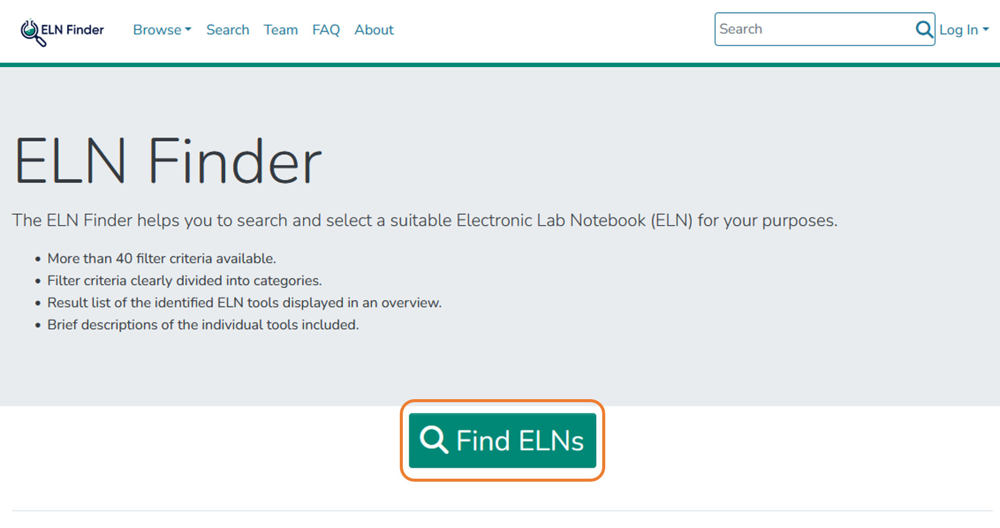
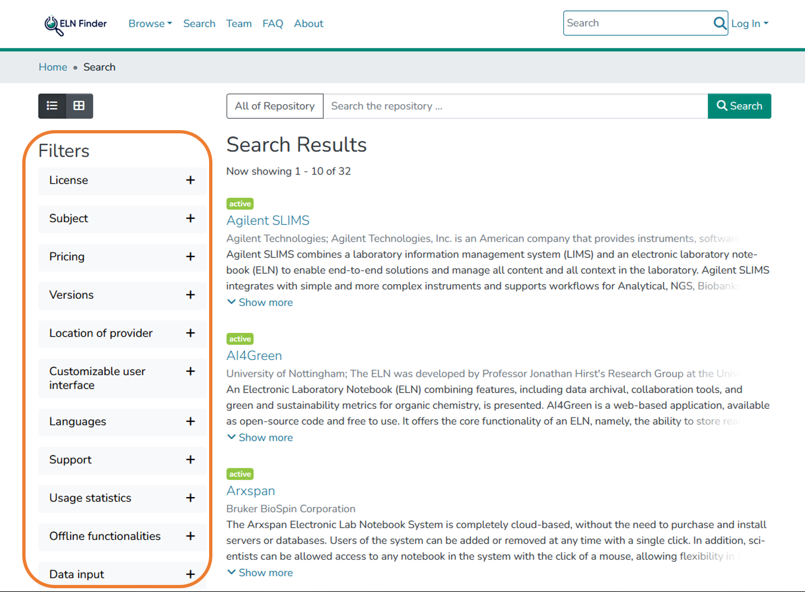
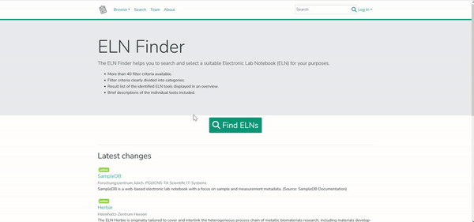

# 2.2 Selection of Electronic Lab Notebooks

For assistance on selecting and implementing an ELN the [ELN Guide](https://doi.org/10.4126/FRL01-006425772) and the [ELN Finder](https://eln-finder.ulb.tu-darmstadt.de/home) can be used.

---

## Syllabus Elements

### Learning Objectives

At the end of the section the learners can ...

- **Select** an electronic lab notebook that fits their needs

### Target Audience
- attendees of this course

### Duration
- 10 minutes

### Prerequisites
- Complete [2.1 Introduction to Electronic Lab Notebooks](2.1_Introduction_Electronic_Lab_Notebooks.md)

### Learning Tools

- [ELN Finder](https://eln-finder.ulb.tu-darmstadt.de/home)

---

## Selection of Electronic Lab Notebooks: How do I decide which ELN fits me?

> The following information is translated from [forschungsdaten.info](https://forschungsdaten.info/themen/beschreiben-und-dokumentieren/elektronische-laborbuecher/) licensed under a [CC0 license](https://creativecommons.org/publicdomain/zero/1.0/deed.de).

There are now a large number of ELNs on the market. They cover different requirements, some are generic, others are discipline-specific. Accordingly, the choice of the appropriate ELN is up to the user. To find out which ELN is best suited to you and your research, and how to implement one in your laboratory, we recommend the ELN Finder and the ELN Guide.

„There is no “one-size-fits-all” answer to the question of whether to develop a solution in-house or opt for an open-source or commercial product.“[^1]

### ELN-Guide

> The content in this section is adapted from the [ELN-Guide](https://doi.org/10.4126/FRL01-006425772) by [ZB MED](https://www.zbmed.de/) licenced under a [CC BY 4.0 licence](https://creativecommons.org/licenses/by/4.0/deed.en).

More and more laboratories are replacing their paper lab notebooks with electronic laboratory notebooks, or ELNs.
But this transition is about **more than just replacing paper with digital alternatives**. It’s also about finding ways to integrate electronic lab notebooks into an overarching digital research data management (RDM) system.

The [ELN-Guide](https://doi.org/10.4126/FRL01-006425772) provides:

- Requirements for an Electronic Lab Notebook
- Procedure for the introduction of an ELN
- Best-Practice-Examples
- Toolboxes for needs assessment

### ELN Finder

>The content in this section is adapted from [ELN Finder](https://eln-finder.ulb.tu-darmstadt.de/home).

The [ELN Finder](https://eln-finder.ulb.tu-darmstadt.de/home) helps you to search and select a suitable Electronic Lab Notebook (ELN) for your purposes. The ELN Finder uses the [following metadata schema](https://doi.org/10.4126/FRL01-006452815).

##### Hands on: ELN Finder

1. Go to the website: [https://eln-finder.ulb.tu-darmstadt.de/home](https://eln-finder.ulb.tu-darmstadt.de/home)
2. Click on „`Find ELNs`“
3. Search for an ELN that fits your needs using the filter criteria, e.g. `License` or `Subject` .

##### Video on: How to use the ELN Finder

!!! example "Exercise 2.1: ELN Finder"

	Now it is your turn: Go to the website of [ELN Finder](https://eln-finder.ulb.tu-darmstadt.de/) and look for an ELN that fits your needs. Which one might be a good solution for you? Name it.
## Summary

- There are different categories and providers of ELNs, therefore it can be helpful to use one of the presented tools to select the right ELN

## Suggested Reading
- ZB MED – Information Centre for Life Sciences (2021): ELN Guide. Electronic laboratory notebooks in the context of research data management and good research practice – a guide for the life sciences. [https://doi.org/10.4126/FRL01-006425772](https://doi.org/10.4126/FRL01-006425772).
- NFDI4Chem Knowledge Base: [https://knowledgebase.nfdi4chem.de/knowledge_base/docs/choose_eln/](https://knowledgebase.nfdi4chem.de/knowledge_base/docs/choose_eln/)

## References

[^1]: ZB MED – Information Centre for Life Sciences (2021): ELN Guide. Electronic laboratory notebooks in the context of research data management and good research practice – a guide for the life sciences. [https://doi.org/10.4126/FRL01-006425772](https://doi.org/10.4126/FRL01-006425772).

