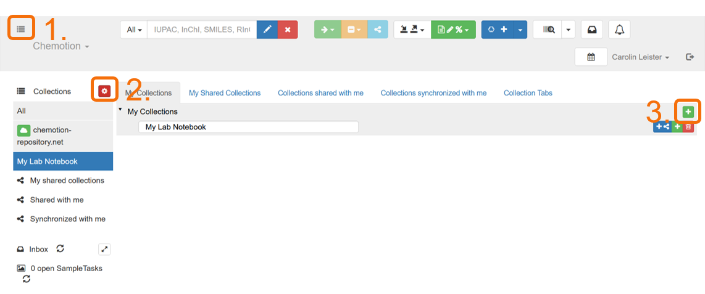
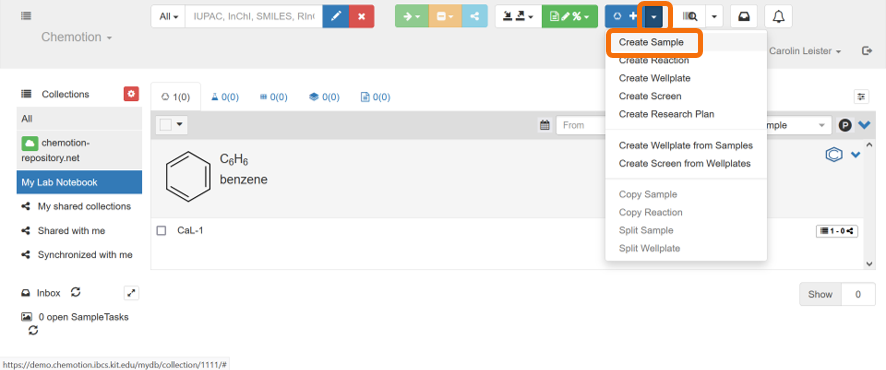
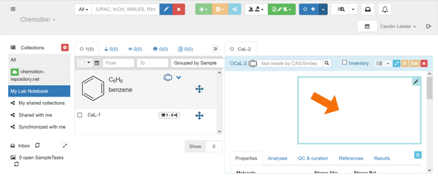

# 2.3 Example: Chemotion

>The content in this section is adapted from [RDM@KIT](https://www.rdm.kit.edu/english/servicestools_tools_chemotion.php).

[Chemotion](https://www.chemotion-repository.net/home/welcome) offers a free-to-use infrastructure and open source software for the management of research data, especially for chemists and related sciences. Chemotion includes a suite consisting of an [electronic laboratory notebook](https://www.rdm.kit.edu/english/researchdata_rdm_eln.php) ([Chemotion ELN](https://www.chemotion.net/)), a [web repository](https://doi.org/10.17616/R34P5T) and helpful tools. The goal is to simplify routine work with molecular data, thus increasing the amount of open data and improving the quality of the information obtained and published.  
The software is increasingly being extended to related fields and further developed into a generic ELN (“[LabIMotion](https://chemotion.net/docs/labimotion)”). You can find more information about Chemotion on the [website](https://www.chemotion.net/), as well as via [NFDI4Chem](https://www.nfdi4chem.de/setup-own-eln/), which regularly holds events such as [Q&As and hands-on workshops](https://www.nfdi4chem.de/events/), and via the [Chemotion ELN YouTube channel](https://www.youtube.com/@chemotioneln9781?cbrd=1&ucbcb=1).

---

## Syllabus Elements

### Learning Objectives

At the end of the section the learners can ...

- **Recognizes** basic elements in the program Chemotion
- **Define** use cases for Chemotion 
- **Determine** whether Chemotion is suitable for them
- **Knows** where to get further information on Chemotion

### Target Audience
- attendees of this course

### Duration
- 15 minutes

### Prerequisites
- Complete [2.1 Introduction to Electronic Lab Notebooks](2.1_Introduction_Electronic_Lab_Notebooks.md)

### Learning Tools

- [Chemotion](https://www.chemotion.net/)

---

## Example: Chemotion

### What is Chemotion?

- [Chemotion](https://www.chemotion.net/)  is an Electronic Laboratory Notebook (ELN) & Repository for Research Data
	- [Chemotion ELN](https://www.chemotion.net/docs/eln) - an electronic laboratory notebook (ELN)
	- [Chemotion Repository](https://www.chemotion.net/docs/repo) - a data repository
- Subject-specific for Chemistry and related fields
- Open Source Software
- Developed at Institute of Organic Chemistry (IOC) / Institute of Biological and Chemical Systems – Functional Molecular Systems (IBCS-FMS) at KIT
- Connected repository for publication of data
- [Recommended ELN](https://www.nfdi4chem.de/index.php/setup-own-eln/) of the [National Research Data Infrastructure for Chemistry (NFDI4Chem)](https://www.nfdi4chem.de/)

### Chemotion ELN

> The information in this section is adapted from [Fink et al. (2023): Chemotion ELN Instruction Videos](https://doi.org/10.5281/zenodo.7634481) licenced under [CC BY 4.0](https://creativecommons.org/licenses/by/4.0/legalcode).

- You can store in the ELN
	- Experimental instructions
	- Structures (Samples)
	- Reactions
	- Analytical data
	- Access to your working groups shared list of chemicals ([Inventory](https://www.chemotion.net/docs/eln/ui/inventory))

- Further functions:
	- [Barcode and QR code generation](https://www.chemotion.net/docs/eln/ui/barcodes) for example for Bruker instruments
	- [Ontologies implementation](https://www.chemotion.net/docs/eln/ui/ontology) (RXNO, CHMO)
	- [Calender function](https://www.chemotion.net/docs/eln/ui/calendar)
	- [Image editing and annotation](https://www.chemotion.net/docs/eln/ui/images)
	- ...

> This video is used from [Chemotion ELN](https://www.youtube.com/@chemotioneln9781) published as [Fink et al. (2023): Chemotion ELN Instruction Videos](https://doi.org/10.5281/zenodo.7634481) licenced under [CC BY 4.0](https://creativecommons.org/licenses/by/4.0/legalcode).

First instructional video on Chemotion can be found on [Youtube](https://www.youtube.com/watch?v=MnOcKV-MTTg&list=PL1AonKd9WAd8cDjzXGiNu0ndoctNu0izs):

<iframe width="560" height="315" src="https://www.youtube.com/embed/MnOcKV-MTTg?si=_1hMw7xNfkCynHw-" title="YouTube video player" frameborder="0" allow="accelerometer; autoplay; clipboard-write; encrypted-media; gyroscope; picture-in-picture; web-share" allowfullscreen></iframe>

#### Hands-on Chemotion ELN
- Go to the [Demo version](https://demo.chemotion.ibcs.kit.edu/home) of Chemotion ELN
- Click on `Sign up` to create an account for the Demo version
- **Create a collection** with your favorite name (e.g. 'My Lab Notebook')

- **Add a sample** by using the molecule structure editor Ketcher
	- Click on your new collection and then on the blue arrow near the `+` and `Create sample`
	- Then click in the Editor field
	- Scetch your desired chemical structure
	- Do not forget to save your sample! Therefore click on the blue `Save`-Button, and then on the yellow `Save sample`-Button

- **Add additonal information** on your molecule
	- Click on your molecule and on `CaL-1`
	- Then add additional information like `Amount`, `Density`, `Molarity`, `Concentration`, `Solvents` `Boiling point` and so on.
	- Note: Adding the `Density` or the `Molarity` is essential. Automatic calculation of the mass (by volume)
	- Further down you can find the automatically generated SMILES and InChI codes
	- In the `Analysis`-Section you can add Analysis like NMR data
	- You can also add Literature by the DOI in the `Literature`-Section
	- For more information click [here](https://www.chemotion.net/docs/eln/ui/details_modal).

You can also add reactions and analysis and much more. When you want to publish your data you can do this directly in the [Chemotion Repository](https://www.chemotion-repository.net/welcome).
## Summary

- Chemotion is an Electronic Lab Notebook and Repository for Chemistry Data

## References
### Further information
- Upcoming events on Chemotion ELN
	- [Hands-on Workshop](https://www.nfdi4chem.de/index.php/event/chemotion-eln-hands-on-workshop/)
	- [Q&A Session](https://www.nfdi4chem.de/index.php/event/chemotion-eln-qa-session/)
	- [NFDI4Chem Stammtisch]([NFDI4Chem Stammtisch](https://www.nfdi4chem.de/index.php/nfdi4chem-stammtisch/))
- Upcoming events on LabIMotion
	- [Hands-on Workshop](https://www.nfdi4chem.de/event/labimotion-online-hands-on-workshop/)
- More information
	- [YouTube-Videos](https://www.youtube.com/@chemotioneln9781)
	- [How to set up your own Chemotion ELN](https://www.nfdi4chem.de/index.php/setup-own-eln/)
	- [Source Code on GitHub](https://github.com/ComPlat/chemotion_ELN)
	- [Documentation](https://chemotion.net/docs/)
	- Chemotion in the [ELN Finder](https://eln-finder.ulb.tu-darmstadt.de/items/e234d033-9718-41dd-9a4c-1cf6963b2dd2)

- You need help:
	- Contact the [helpdesk](https://www.chemotion.net/helpdesk)

### Suggested reading

- Tremouilhac et al. (2017): Chemotion ELN: an Open Source electronic lab notebook for chemists in academia. In: Journal of cheminformatics 9 (1), p. 54. DOI: [https://doi.org/10.1186/s13321-017-0240-0](https://doi.org/10.1186/s13321-017-0240-0).
- Kotov et al. (2018): Chemotion-ELN part 2: adaption of an embedded Ketcher editor to advanced research applications. In: Journal of cheminformatics 10 (1), p. 38. DOI: [https://doi.org/10.1186/s13321-018-0292-9](https://doi.org/10.1186/s13321-018-0292-9).